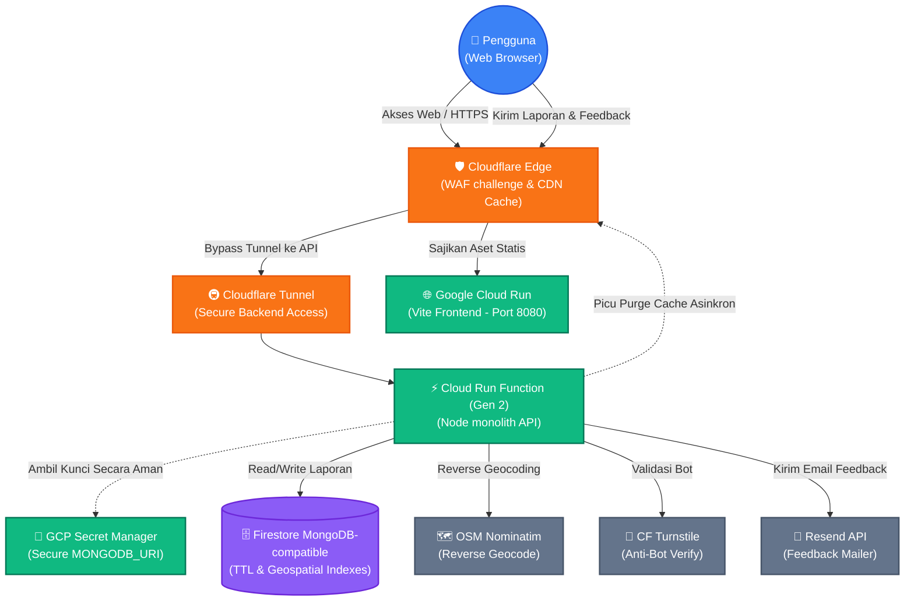

# 🛡️ StaySafe.my.id — Peta Keamanan & Titik Rawan Indonesia

[](https://vuejs.org/)
[](https://vitejs.dev/)
[](https://tailwindcss.com/)
[](https://leafletjs.com/)
[](https://nodejs.org/)
[](https://cloud.google.com/)
[](https://www.terraform.io/)
[](https://www.cloudflare.com/)

**StaySafe.my.id** adalah platform pemetaan interaktif *real-time* yang dirancang untuk memetakan kerawanan sosial dan insiden keamanan di Indonesia. Melalui platform ini, masyarakat dapat memantau titik-titik rawan kejahatan seperti **begal, copet, jambret, tawuran, pelecehan seksual, vandalisme, dan penipuan** di sekitar mereka secara langsung, sekaligus berpartisipasi melaporkan kejadian demi meningkatkan kewaspadaan bersama.

Aplikasi ini mengusung desain bernuansa gelap yang modern (*sleek dark mode*), visualisasi interaktif yang memukau (*glassmorphism*, kelancaran animasi), performa *serverless* yang andal di Google Cloud Platform, serta integrasi proteksi keamanan tingkat tinggi dari Cloudflare.

---

## 🗺️ Fitur Utama (Main Features)

### 🎨 Frontend & Visualisasi Peta
*   **Semantic Zooming**: Peta cerdas yang menyesuaikan tampilan secara otomatis berdasarkan tingkat perbesaran. Pada *zoom* rendah (< 15), peta akan memvisualisasikan data dalam bentuk **Glowing Heatmap** (zona panas kerawanan). Pada *zoom* tinggi (>= 15), peta bertransisi secara mulus ke **Marker Cluster** interaktif.
*   **Cluster Mode dengan Analisis Mayoritas**: Saat marker mengelompok, sistem secara otomatis menghitung subkategori insiden yang paling sering terjadi (mode mayoritas) dalam kelompok tersebut dan mewarnai indikator visual kluster sesuai kategori mayoritas tersebut.
*   **Glassmorphic Tooltip & Popups**: Detail insiden ditampilkan dengan kartu melayang transparan modern yang didukung efek *backdrop-blur* premium.
*   **Interactive Onboarding Tour**: Panduan interaktif visual bagi pengguna baru menggunakan alur animasi langkah-demi-langkah.
*   **Cerdas Deteksi Lokasi & Recenter**: Melacak lokasi GPS pengguna secara *real-time*, memposisikan peta dengan denyut biru (*blue pulse*), serta mendeteksi secara otomatis wilayah administratif pengguna untuk memfilter regional peta.
*   **Simulated Geolocation Fallback**: Jika GPS tidak diizinkan atau gagal mendeteksi koordinat, sistem secara cerdas beralih ke lokasi simulasi Monas/Thamrin (Jakarta Pusat) demi kenyamanan pengguna.

### ⚡ Backend & API Serverless
*   **Unified API Monolith**: Seluruh fungsi backend (GET laporan, POST laporan, dan statistik pengelompokan geografis) dikonsolidasikan ke dalam satu Google Cloud Run Function (Gen 2) yang cepat dan hemat biaya.
*   **Reverse Geocoding Berperforma Tinggi**: Konversi koordinat lintang/bujur menjadi alamat manusiawi secara otomatis menggunakan API OpenStreetMap Nominatim dengan *safety-timeout* ketat 1.5 detik (menggunakan *AbortController* Node 18+) agar API StaySafe tidak terhambat.
*   **Validasi Batasan Spasial (Bounding Box)**: Mencegah spam dengan membatasi pembuatan laporan hanya di dalam koordinat spasial wilayah Jakarta dan sekitarnya (Jabodetabek).
*   **Cloudflare Turnstile CAPTCHA**: Verifikasi keamanan anti-bot dari Cloudflare yang diimplementasikan secara kokoh di sisi klien dan divalidasi secara ketat di sisi server.
*   **On-Demand CDN Cache Purge**: Untuk efisiensi bandwidth, API StaySafe menyajikan *Cache-Control* publik selama 5 menit. Namun, sesaat setelah laporan baru berhasil dibuat, API secara asinkron (*fire-and-forget*) mengirimkan sinyal ke Cloudflare API untuk melakukan *cache purge* secara instan pada URL laporan dan statistik.

### 📧 Sistem Feedback Email Premium
*   Bypass Database: Masukan/laporan bug pengguna dikirimkan langsung ke kotak masuk developer menggunakan **Resend API**.
*   **Desain Email HTML Premium**: Email yang masuk diformat secara indah, berkelas, rapi, dan mudah dibaca di berbagai perangkat.

### 🗄️ Strategi & Optimasi Database
*   **Geospatial Index (2dsphere)**: Memungkinkan pencarian laporan berbasis radius atau batas kotak wilayah secara instan.
*   **Time-to-Live Index (TTL)**: Kebijakan privasi dan relevansi data otomatis; laporan diatur agar otomatis terhapus dari database setelah berumur **30 hari**.
*   **Compound Index**: Pengurutan dan filter gabungan `category: 1` dan `createdAt: -1` untuk performa query yang optimal.

---

## 📐 Arsitektur Sistem (System Architecture)



---

## 📂 Struktur Direktori (Directory Structure)

```text
staysafe.my.id/
├── .env.example                  # Template variabel lingkungan lokal
├── .gitignore                    # Kebijakan gitignore ketat untuk keamanan rahasia
├── Dockerfile                    # Docker multi-stage build untuk Vite & Nginx
├── cloudbuild.yaml               # Konfigurasi pipa kompilasi Google Cloud Build
├── deploy.sh                     # Script otomatisasi deploy frontend ke GCP (Ignored)
├── index.html                    # Kerangka HTML utama dengan metadata SEO lengkap
├── nginx.conf                    # Konfigurasi routing Nginx untuk Production SPA
├── package.json                  # Dependencies Frontend (Vue 3, Leaflet, Tailwind)
├── postcss.config.js
├── tailwind.config.js
├── vite.config.js
├── backend/                      # Backend Scope
│   ├── package.json
│   ├── seed-mockdata.js          # Script pengisi 65 data simulasi insiden
│   ├── setup-indexes.js          # Script inisialisasi indeks geospatial & TTL
│   ├── api/                      # Cloud Run Function Source Code
│   │   ├── categories.js         # Validasi kategori & subkategori
│   │   ├── db.js                 # Database connection manager (Cached connection pool)
│   │   ├── index.js              # Monolith endpoints handler (GET/POST/Stats/Feedback)
│   │   └── package.json
│   └── common/                   # Shared backend utility
│       ├── categories.js
│       └── db.js
├── src/                          # Frontend Source Code
│   ├── App.vue                   # Komponen utama & kerangka tata letak
│   ├── main.js
│   ├── style.css
│   ├── assets/                   # Image & Logo assets
│   ├── components/               # Komponen Modular Vue
│   │   ├── MapView.vue           # Container Peta Leaflet
│   │   ├── MapLegend.vue         # Panduan Legenda Kategori Insiden
│   │   ├── MapSearch.vue         # Kolom Pencarian Lokasi Administratif
│   │   ├── OnboardingTour.vue    # Panduan Interaktif Pengguna Baru
│   │   ├── PolicyModal.vue       # Kebijakan Privasi & Ketentuan Penggunaan
│   │   ├── ReportForm.vue        # Form Pelaporan Insiden & CF Turnstile
│   │   └── ReportPanel.vue       # Panel Samping Daftar Laporan & Feedback
│   ├── composables/              # Vue Composition API
│   │   ├── categories.js
│   │   ├── useMap.js             # Singleton State Map & Leaflet logic
│   │   └── useReports.js         # State management laporan & filter
│   └── config/                   # Konfigurasi statis frontend
│       ├── categories.js
│       └── regions.js            # Koordinat regional Jakarta, Bandung, Surabaya, dll.
└── terraform/                    # Infrastructure as Code (IaC) Scope
    ├── firestore.tf              # Pengelolaan instance basis data & indeks
    ├── frontend.tf               # Pengelolaan Artifact Registry & konfigurasi Frontend
    ├── functions.tf              # Pengelolaan Cloud Run Function & Secret Manager
    ├── main.tf                   # Provider google & Service Enablement API
    ├── outputs.tf                # Output deployment (URL API)
    ├── variables.tf              # Deklarasi variabel input terraform
    ├── terraform.tfvars.example  # Template isian variabel sensitif terraform
    └── files/                    # Build cache untuk zip file fungsi (Ignored)
```

---

## 🔒 Laporan Audit Keamanan & Proteksi Rahasia (Secret Management Audit)

Sebelum siap dipublikasikan (*push*) ke repositori GitHub publik, repositori StaySafe telah diaudit secara komprehensif untuk memastikan **tidak ada variabel sensitif, kunci rahasia (*secret*), kredensial database, atau token yang terekspos**.

Berikut ringkasan hasil audit proteksi data kami:

1.  **File `.gitignore` yang Kokoh & Terarah**:
    Semua berkas lokal berisi data sensitif terdaftar dalam `.gitignore` dan dikonfirmasi aman dari pelacakan git:
    *   `.env` (Menyimpan token terowongan Cloudflare dan kredensial SCRAM MongoDB secara lokal).
    *   `terraform.tfvars` (Menyimpan token API Cloudflare, Turnstile secret, dan MongoDB URI untuk deployment Terraform).
    *   `terraform.tfstate` & `terraform.tfstate.backup` (Menyimpan state infrastruktur yang mungkin mengandung metadata sensitif).
    *   `deploy.sh` (Menyimpan instruksi pipeline build lokal).
    *   `backend/import-prod-*.js` (Data impor produksi temporer).
2.  **Tidak Ada Kebocoran dalam Git History**:
    Pencarian mendalam di seluruh komitmen historis (*git history logs*) untuk string sensitif seperti `staysafeadmin` (username database), token JWT `eyJh`, kunci API, maupun URI koneksi riil menghasilkan **Nol Kebocoran (Zero Leaks)**. Git history bersih dari jejak kredensial masa lalu.
3.  **Audit ZIP File**:
    Berkas `.zip` di dalam direktori `terraform/files/` (`api.zip`, `getReports.zip`, `getStats.zip`, `postReport.zip`) telah didekompresi dan diperiksa. Berkas-berkas tersebut hanya berisi kode logika murni (`index.js`, `db.js`, `package.json`, `categories.js`) dan bebas dari penyisipan berkas `.env` maupun kredensial tertanam.
4.  **Enkripsi Cloud Secret Manager**:
    Semua parameter sensitif backend seperti `MONGODB_URI` dideploy menggunakan Terraform ke dalam layanan **GCP Secret Manager** yang dienkripsi secara aman. Kode backend membacanya secara dinamis melalui penunjuk *secret environment variables* yang aman tanpa menuliskan kunci di kode sumber.

---

## 🛠️ Panduan Memulai (Getting Started)

### 💻 Menjalankan Secara Lokal (Local Development)

#### 1. Persiapan Awal
Kloning repositori ini dan pastikan Anda menggunakan Node.js versi 20 ke atas.
```bash
git clone https://github.com/username/staysafe.my.id.git
cd staysafe.my.id
npm install
```

#### 2. Konfigurasi Variabel Lingkungan Lokal
Buat berkas `.env` di direktori root dengan menyalin template yang ada:
```bash
cp .env.example .env
```
Isi nilai-nilai di dalam berkas `.env` sesuai kredensial lokal atau testing Anda.

#### 3. Inisialisasi Database (MongoDB)
Pastikan MongoDB Anda menyala dan jalankan script penyiapan indeks database:
```bash
MONGODB_URI="koneksi-mongodb-anda" node backend/setup-indexes.js
```
*(Opsional)* Anda dapat menyiram database lokal dengan 65 data insiden simulasi agar peta langsung menyala:
```bash
MONGODB_URI="koneksi-mongodb-anda" node backend/seed-mockdata.js
```

#### 4. Menjalankan Server Pengembangan Frontend
```bash
npm run dev
```
Buka `http://localhost:5173` di browser Anda.

---

## 🚀 Panduan Rilis Infrastruktur & Aplikasi (Deployment Guide)

Platform StaySafe dideploy secara penuh ke Google Cloud Platform menggunakan kombinasi **Terraform (IaC)** untuk infrastruktur, dan **Google Cloud Build** untuk kompilasi gambar kontainer frontend.

### 🤖 Bagian 1: Inisialisasi Infrastruktur (Terraform)
1.  Masuk ke direktori terraform:
    ```bash
    cd terraform
    ```
2.  Buat berkas `terraform.tfvars` dari berkas contoh:
    ```bash
    cp terraform.tfvars.example terraform.tfvars
    ```
3.  Isi variabel di dalam `terraform.tfvars` dengan ID proyek Google Cloud Anda dan kredensial produksi lainnya secara tepat.
4.  Jalankan perintah Terraform:
    ```bash
    terraform init
    terraform plan   # Pastikan resource yang dibuat sudah sesuai
    terraform apply  # Terapkan perubahan ke GCP
    ```
5.  Catat nilai `api_url` yang muncul pada output terminal setelah proses apply selesai.

### 🌐 Bagian 2: Rilis Frontend & Pipeline Kompilasi
Gunakan script otomatis `deploy.sh` yang ada di root direktori untuk menyatukan variabel lingkungan lokal Anda, mengompilasi image Docker di Google Cloud Build, dan merilisnya ke Cloud Run secara aman:
1.  Kembali ke direktori root:
    ```bash
    cd ..
    ```
2.  Beri izin eksekusi pada script deployment lokal:
    ```bash
    chmod +x deploy.sh
    ```
3.  Jalankan deployment:
    ```bash
    ./deploy.sh
    ```
    Script ini akan membaca `VITE_API_BASE_URL` dari `.env` lokal Anda secara dinamis, mengirimkannya sebagai argumen build yang aman ke Cloud Build, dan memperbarui layanan Cloud Run Frontend staysafe secara otomatis.

---

## 📜 Lisensi & Aturan Hak Cipta (License)

Seluruh kode sumber di dalam platform ini dilindungi oleh hak cipta resmi **StaySafe Indonesia**. Detail lisensi dan ketentuan penggunaan untuk publik dapat dibaca secara lengkap pada berkas [PolicyModal.vue](file:///Users/at/Documents/staysafe.my.id/src/components/PolicyModal.vue) di dalam kode sumber aplikasi atau melalui menu Syarat & Ketentuan di web staysafe.my.id.

---
*Dibuat dengan dedikasi penuh untuk keamanan dan kenyamanan mobilitas masyarakat Indonesia. Lindungi diri Anda, lindungi sesama.* 🛡️🇮🇩
